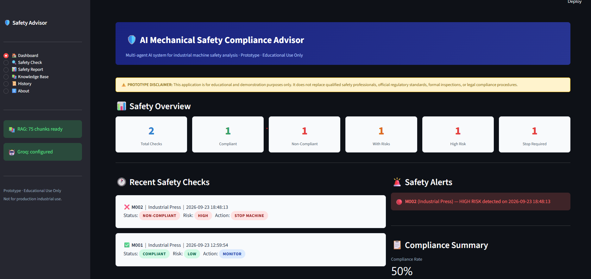
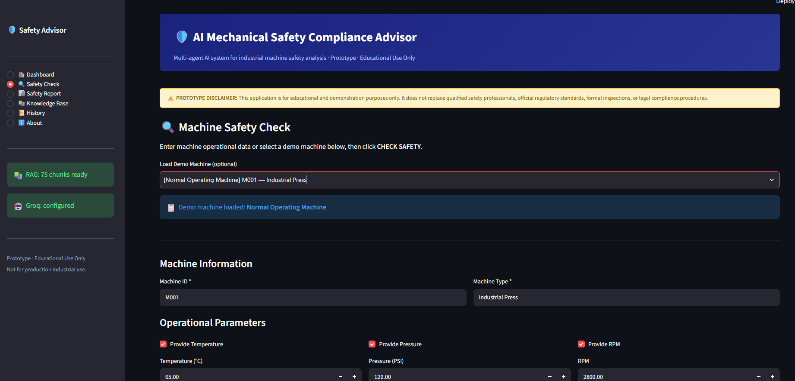
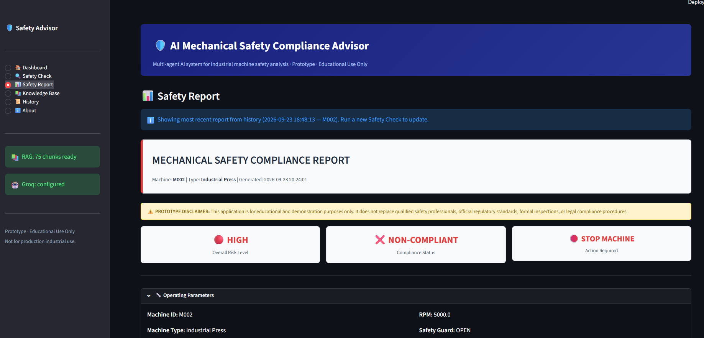
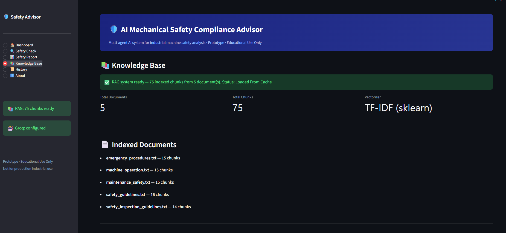
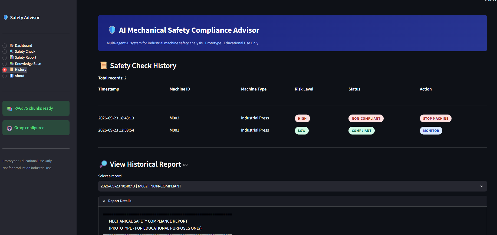
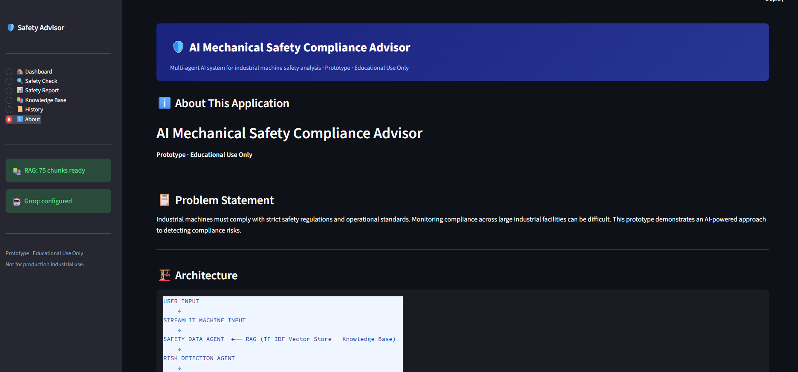

# 🛡️ AI Mechanical Safety Compliance Advisor

An AI-powered mechanical safety compliance system that analyzes machine operating conditions, identifies potential safety risks, retrieves relevant safety guidelines using Retrieval-Augmented Generation (RAG), and provides compliance recommendations.

> **Note:** This project is an educational prototype and does not replace qualified safety professionals, official safety standards, inspections, or regulatory compliance procedures.

---

## 📌 Project Overview

The **AI Mechanical Safety Compliance Advisor** is an educational AI prototype designed to assist with mechanical and industrial machine safety analysis.

The system combines:

* 🤖 AI-powered analysis
* 📚 Retrieval-Augmented Generation (RAG)
* 👥 Multi-agent architecture
* 📊 Machine operational data
* ⚠️ Risk detection
* ✅ Compliance verification
* 💡 Safety recommendations

The application allows users to enter machine operating parameters and receive an AI-assisted safety assessment based on the project's knowledge base.

---

## ✨ Features

### 🔍 Machine Safety Analysis

Analyzes machine operating conditions such as:

* Temperature
* Pressure
* RPM
* Safety guard status
* Emergency-stop status
* Other machine safety parameters

### ⚠️ Risk Detection

Identifies potentially unsafe operating conditions and classifies detected risks.

Example input:

```text
Temperature: 120°C
Pressure: 250 PSI
RPM: 5000
Safety Guard: OPEN
```

A possible assessment could be:

```text
HIGH RISK
NON-COMPLIANT
STOP MACHINE
```

> These example values are illustrative and should not be treated as actual safety thresholds.

### 📚 RAG-Based Knowledge Retrieval

The system retrieves relevant information from a local safety knowledge base before generating recommendations.

Knowledge sources include:

* `safety_guidelines.txt`
* `machine_operation.txt`
* `maintenance_safety.txt`
* `emergency_procedures.txt`
* `safety_inspection_guidelines.txt`

### 🤖 Multi-Agent Architecture

The project separates different safety-analysis responsibilities into specialized agents:

* **Safety Data Agent**
* **Risk Detection Agent**
* **Compliance Agent**
* **Recommendation Agent**

This allows different stages of the safety-analysis process to be handled independently.

### 💡 Safety Recommendations

Based on the detected conditions and retrieved safety information, the system provides recommendations intended to help users identify appropriate safety actions.

### 📊 Dashboard

The application provides a dashboard for interacting with the safety-analysis system and viewing results.

### 📝 Safety Reports

The system presents analysis results including:

* Machine condition
* Detected risks
* Compliance status
* Safety recommendations

### 📜 History

Safety-analysis results can be stored so previous assessments can be reviewed.

---

## 🏗️ System Architecture

```text
                 ┌───────────────────────┐
                 │         User          │
                 │   Machine Input Data  │
                 └───────────┬───────────┘
                             │
                             ▼
                 ┌───────────────────────┐
                 │      Streamlit UI     │
                 └───────────┬───────────┘
                             │
                             ▼
                 ┌───────────────────────┐
                 │   Safety Data Agent   │
                 └───────────┬───────────┘
                             │
              ┌──────────────┴──────────────┐
              │                             │
              ▼                             ▼
     ┌───────────────────┐       ┌───────────────────┐
     │   RAG Retrieval   │       │ Machine Analysis  │
     └─────────┬─────────┘       └─────────┬─────────┘
               │                           │
               └──────────────┬────────────┘
                              ▼
                 ┌───────────────────────┐
                 │  Risk Detection Agent │
                 └───────────┬───────────┘
                             │
                             ▼
                 ┌───────────────────────┐
                 │   Compliance Agent   │
                 └───────────┬───────────┘
                             │
                             ▼
                 ┌───────────────────────┐
                 │ Recommendation Agent │
                 └───────────┬───────────┘
                             │
                             ▼
                 ┌───────────────────────┐
                 │   Safety Assessment  │
                 │       & Report       │
                 └───────────────────────┘
```

---

## 🧠 Retrieval-Augmented Generation (RAG)

The RAG pipeline allows the application to retrieve relevant safety information from the project's local knowledge base.

The basic workflow is:

```text
Safety Documents
       ↓
Document Loading
       ↓
Text Processing
       ↓
Chunk Creation
       ↓
Vector Representation
       ↓
Similarity Retrieval
       ↓
Relevant Safety Information
       ↓
AI Analysis
       ↓
Safety Recommendation
```

---

## 🤖 Multi-Agent Workflow

```text
Machine Data
     ↓
Safety Data Agent
     ↓
Risk Detection Agent
     ↓
Compliance Agent
     ↓
Recommendation Agent
     ↓
Final Safety Assessment
```

Each agent focuses on a specific stage of the analysis process.

---

## 🛠️ Technology Stack

| Technology   | Purpose                             |
| ------------ | ----------------------------------- |
| Python       | Core programming language           |
| Streamlit    | Web application interface           |
| Groq API     | Large Language Model access         |
| RAG          | Knowledge retrieval                 |
| Scikit-learn | TF-IDF / vector-based retrieval     |
| Pandas       | Data processing                     |
| NumPy        | Numerical processing                |
| Git & GitHub | Version control and project hosting |

---

## 📁 Project Structure

```text
mechanical-safety-advisor/
│
├── app.py
├── requirements.txt
├── README.md
├── .gitignore
├── .env.example
│
├── agents/
│   ├── __init__.py
│   ├── compliance_agent.py
│   ├── recommendation_agent.py
│   ├── risk_detection_agent.py
│   └── safety_data_agent.py
│
├── data/
│   ├── demo_machines.csv
│   └── knowledge_base/
│       ├── emergency_procedures.txt
│       ├── machine_operation.txt
│       ├── maintenance_safety.txt
│       ├── safety_guidelines.txt
│       └── safety_inspection_guidelines.txt
│
├── llm/
│   ├── __init__.py
│   └── groq_client.py
│
├── prompts/
│   ├── compliance_prompt.txt
│   ├── recommendation_prompt.txt
│   ├── risk_detection_prompt.txt
│   └── safety_data_prompt.txt
│
├── rag/
│   ├── __init__.py
│   ├── document_loader.py
│   ├── retriever.py
│   └── vector_store.py
│
├── storage/
│   ├── .gitkeep
│   ├── history.json
│   └── rag_index/
│       ├── chunks.json
│       └── vector_index.pkl
│
├── screenshots/
│   ├── about.png
│   ├── dashboard.png
│   ├── history.png
│   ├── knowledge_base.png
│   ├── safety_check.png
│   └── safety_report.png
│
└── utils/
    ├── __init__.py
    └── helpers.py
```

---

## ⚙️ Installation

### 1. Clone the Repository

```bash
git clone https://github.com/Anusha-Gangoor/AI-Mechanical-Safety-Compliance-Advisor.git
```

### 2. Open the Project

```bash
cd AI-Mechanical-Safety-Compliance-Advisor
```

### 3. Create a Virtual Environment

```bash
python -m venv venv
```

Activate it on Windows:

```bash
venv\Scripts\activate
```

### 4. Install Dependencies

```bash
pip install -r requirements.txt
```

---

## 🔑 API Configuration

Create a `.env` file in the project root:

```text
GROQ_API_KEY=your_groq_api_key_here
```

The actual `.env` file is intentionally excluded from GitHub using `.gitignore`.

### ⚠️ Security

**Never upload your actual API key to GitHub.**

Use `.env.example` as a template:

```text
GROQ_API_KEY=your_groq_api_key_here
```

---

## ▶️ Running the Application

After installing the dependencies and configuring the API key, run:

```bash
streamlit run app.py
```

The application will open in your web browser.

---

## 📊 Example Use Case

A user enters machine operating parameters:

```text
Temperature: 120°C
Pressure: 250 PSI
RPM: 5000
Safety Guard: OPEN
```

The system processes the information through the safety-analysis workflow.

The resulting assessment can include:

```text
Risk Level
Compliance Status
Detected Safety Issues
Safety Recommendations
```

The actual assessment depends on the application's configured rules, knowledge base, and AI analysis.

---

## 📸 Project Screenshots

### 🏠 Dashboard



### 🔍 Safety Check



### 📊 Safety Report



### 📚 Knowledge Base



### 📜 History



### ℹ️ About



---

## 📚 Knowledge Base

The project contains a local safety knowledge base used by the RAG system.

The knowledge base includes information related to:

* Machine operation
* Safety guidelines
* Maintenance safety
* Emergency procedures
* Safety inspections

These documents are processed and indexed so that relevant information can be retrieved during analysis.

---

## 🎯 Project Objectives

The main objectives of this project are:

1. Develop an AI-assisted mechanical safety analysis system.
2. Demonstrate Retrieval-Augmented Generation.
3. Implement a multi-agent architecture.
4. Detect potentially unsafe machine conditions.
5. Provide safety and compliance recommendations.
6. Maintain a history of safety assessments.
7. Demonstrate the use of AI in an industrial safety application.

---

## 🔐 Security Considerations

* API keys are stored using environment variables.
* `.env` is excluded from version control.
* `.env.example` is provided as a configuration template.
* No real confidential industrial data should be uploaded to the application.

---

## ⚠️ Limitations

This project is an **educational prototype**.

It should not be used as the sole basis for:

* Industrial safety decisions
* Regulatory compliance certification
* Machine operation approval
* Emergency response
* Professional safety inspections

Real-world applications require validation against applicable laws, regulations, manufacturer specifications, engineering standards, and qualified safety professionals.

---

## 🚀 Future Enhancements

Possible future improvements include:

* Real-time machine sensor integration
* IoT-based monitoring
* Automated alerts
* More advanced risk scoring
* PDF safety report generation
* User authentication
* Role-based access control
* Database integration
* Additional industrial safety standards
* Improved AI model integration
* Deployment to a cloud platform
* Machine-specific safety profiles

---

## 🎓 Academic Project

This project was developed as an educational/academic project to demonstrate the practical application of:

* Artificial Intelligence
* Large Language Models
* Retrieval-Augmented Generation
* Multi-Agent Systems
* Python
* Streamlit
* Machine Safety Analysis

---

## ⚠️ Disclaimer

This application provides AI-assisted informational analysis for educational purposes only.

It does not replace professional engineering judgment, qualified safety personnel, official standards, manufacturer documentation, workplace inspections, or applicable regulatory requirements.

Users should verify all safety-related information with appropriate qualified professionals before taking real-world action.

---

## 📄 License

This project is intended for educational and academic purposes.
